# Abrace


## Descrição

O Abrace é uma plataforma dedicada à promoção da solidariedade e ao apoio à comunidade. Com o Abrace, você pode facilmente criar e participar de projetos solidários que fazem a diferença na vida das pessoas.

## Funcionalidades Principais
- Cadastro, login, edição e exclusão de perfil
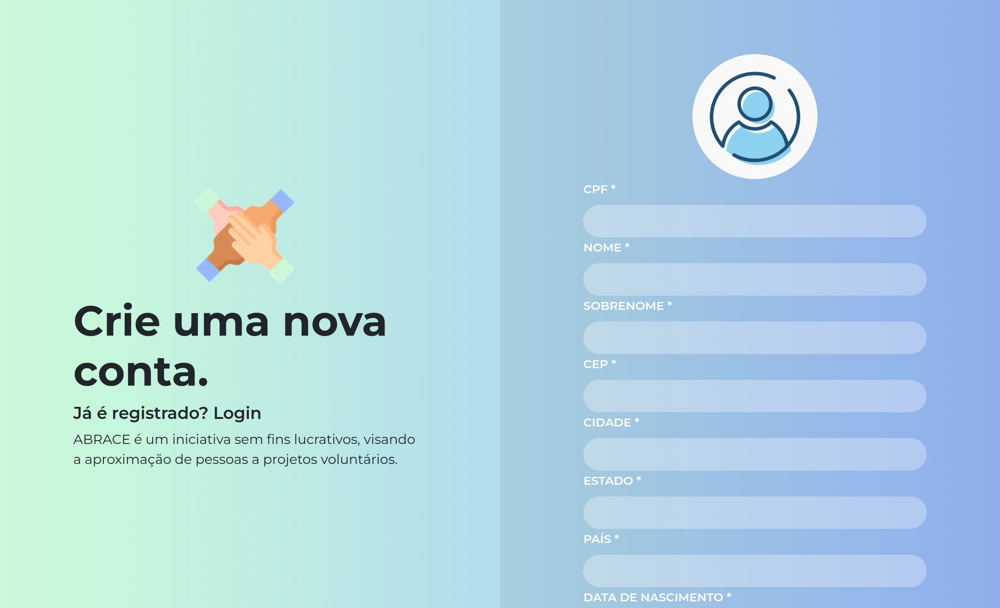
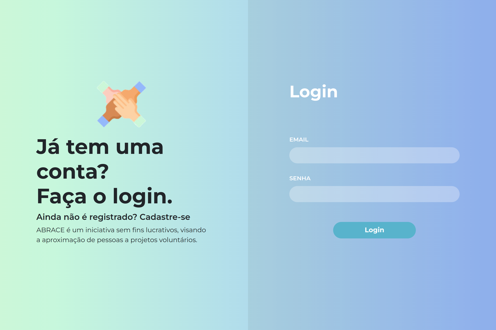
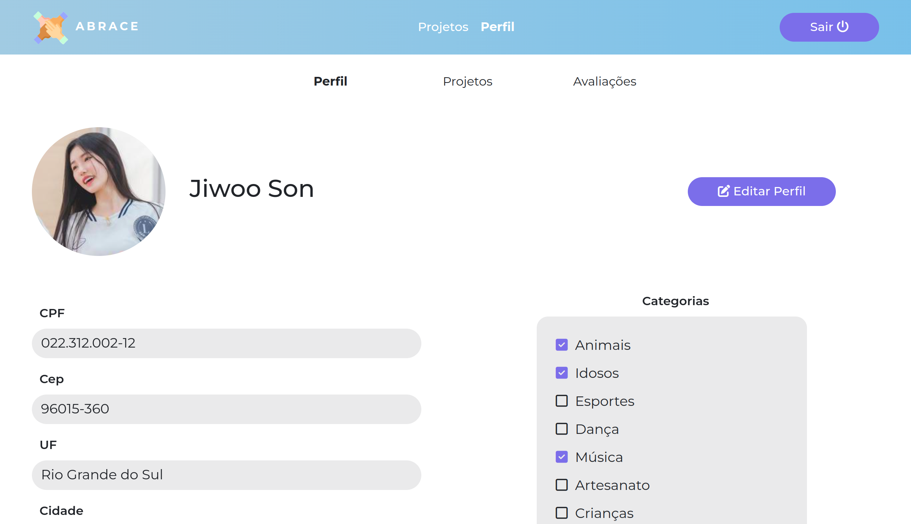
- Criação e moderação de projetos, permitindo editar projeto, excluir projeto, aceitar ou recusar solicitações de membros, remover um membro e adicionar ou remover um moderador
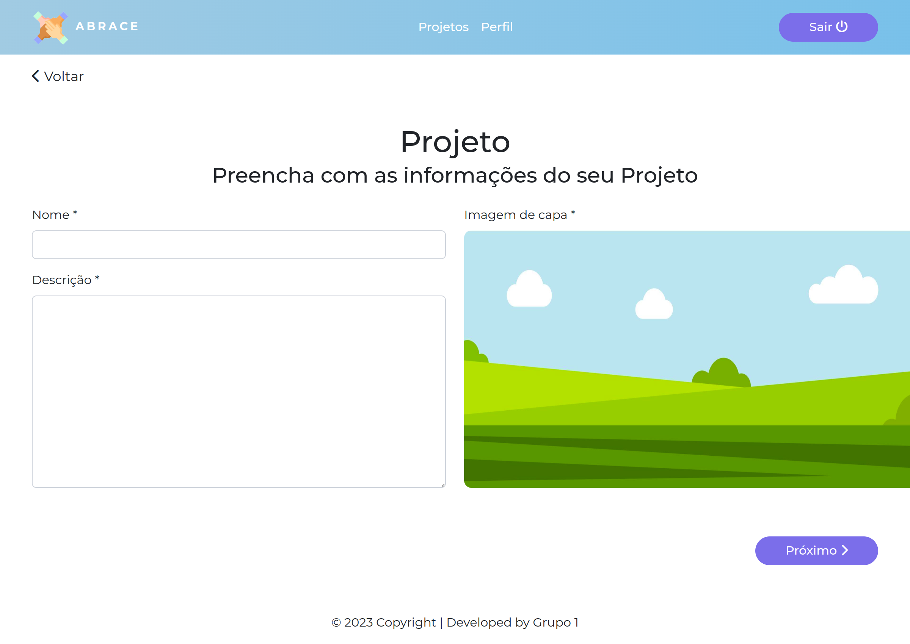
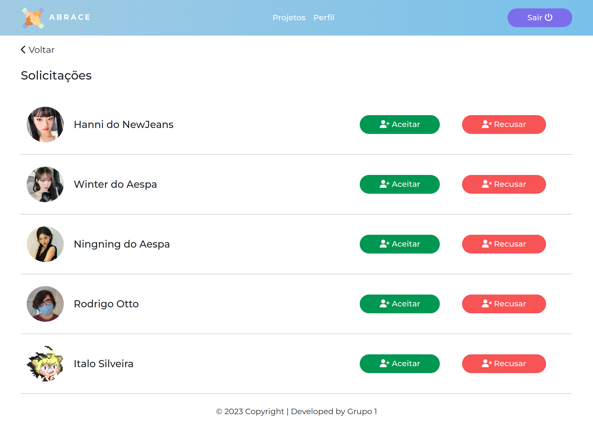
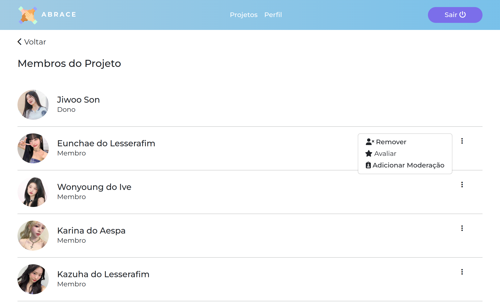
- Postagens e comentários no projeto
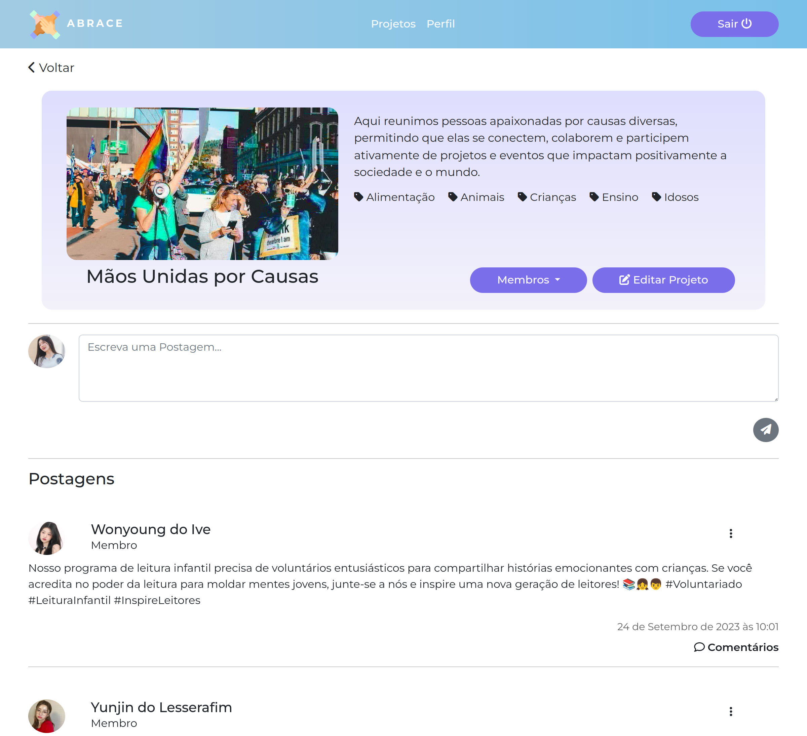
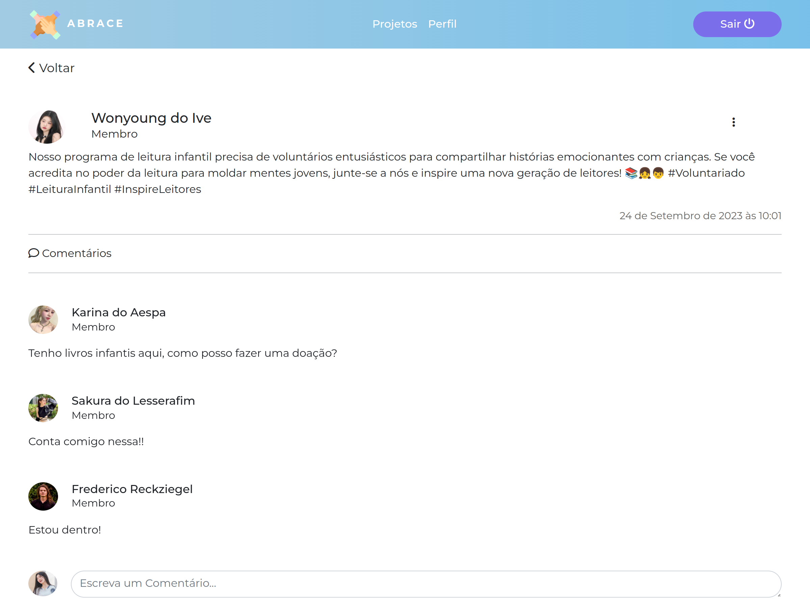
- Avaliação de usuários
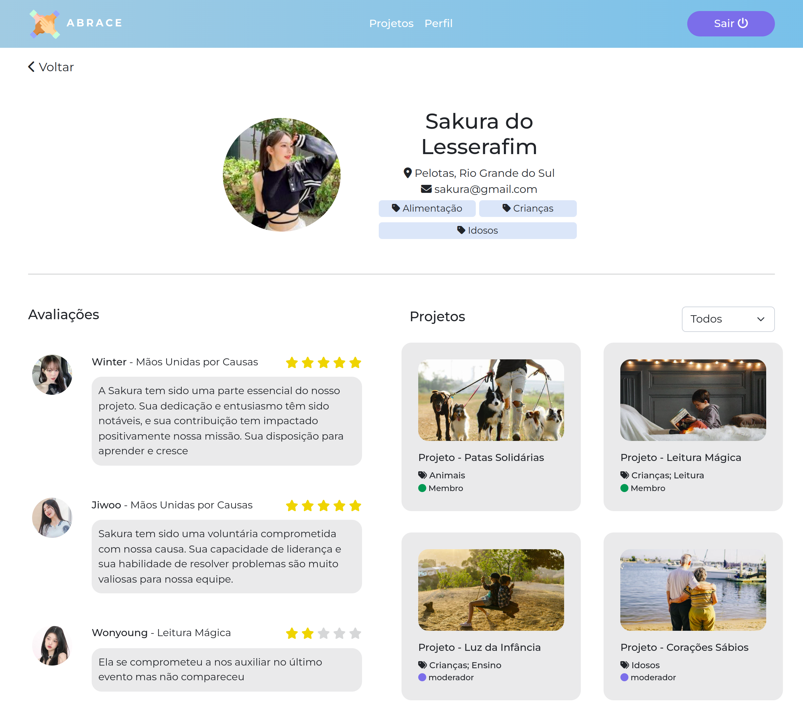
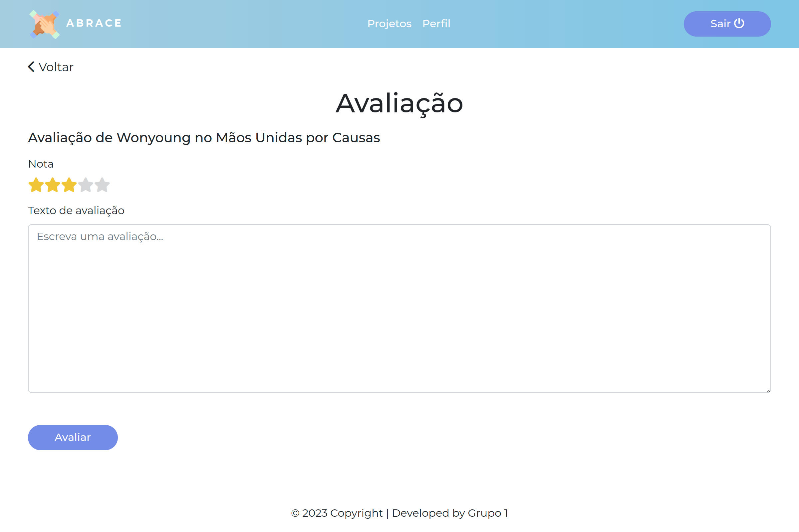
- Recomendação de projetos baseado em preferências do usuário
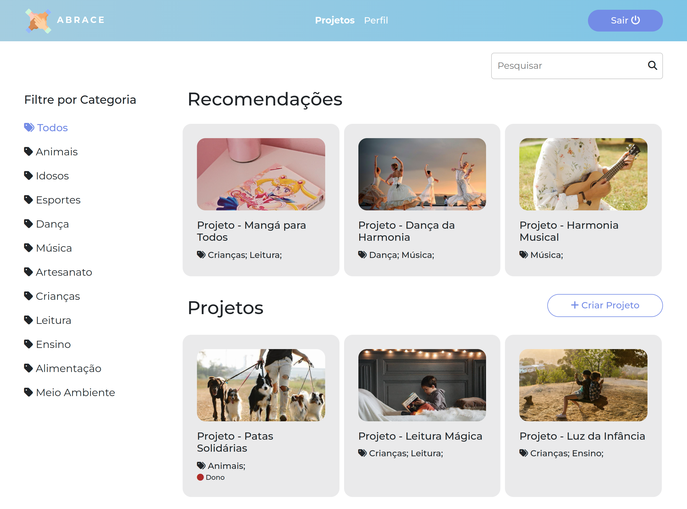

## Nossa Equipe
Somos uma equipe incrível que desenvolveu uma ideia para aproximar voluntários dedicados a fazer a diferença em nossas comunidades e no mundo. Acreditamos no poder da ação voluntária e no impacto positivo que ela pode ter em nossas vidas e naqueles que ajudamos.

### Gabriele Lucas

- **Função:** Tech Lead e QA
   
- **GitHub:** [SLGabi](https://github.com/SLGabi)

### Diulia Deon

- **Função:** UI/UX Design
   
- **GitHub:** [diuliad](https://github.com/diuliad)

### Kayara Silveira

- **Função:** Desenvolvedora Full Stack e Arquiteta de Software
   
- **GitHub:** [kayarasilveira](https://github.com/kayarasilveira)

### Frederico dal Soglio

- **Função:** Desenvolvedor Back end
   
- **GitHub:** [FredDsR](https://github.com/FredDsR)

### Rafael Copes

- **Função:** Desenvolvedor Front end
   
- **GitHub:** [RafaelCopes](https://github.com/RafaelCopes)

### Italo Silveira

- **Função:** Desenvolvedor Front end
   
- **GitHub:** [italotss](https://github.com/italotss)


## Instalação

Para executar o projeto localmente, siga estas etapas:

1. Clone este repositório:
   ```bash
   git clone https://github.com/KayaraSilveira/Abrace.git
   ```
2. Crie e Ative o ambiente virtual:

No Windows 
```bash
   python -m venv venv
   venv\Scripts\activate
```

No macOS e Linux 
```bash
   python3 -m venv venv
   source venv/bin/activate
 ```

3. Instale as dependências
```bash
pip install -r requirements.txt
```

4. Crie o banco de dados
```bash
python manage.py migrate
```

5. Crie um super usuário
```bash
python manage.py createsuperuser
```

6. Rode o servidor
```bash
python manage.py runserver
```

7. Acesse a url http://127.0.0.1:8000/accounts/register/ para criar sua conta e navegar pelo Abrace

**OBS**
Para criação de categorias de projetos entre no django admin e crie as categorias desejadas no model Category. O Login no django admin é feito com Email e senha do super usuário acessando a url http://127.0.0.1:8000/admin. Nunca utilize seu super usuário para navegar pelo sistema Abrace, para isso crie uma conta em http://127.0.0.1:8000/accounts/register/.
